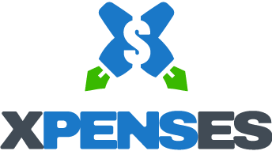

# XpensES



> XpenseS is a mobile web application where you can manage your budget: you have a list of transactions associated with a category, so that you can see how much money you spent and on what..

## Live demo

- Visit: https://glacial-thicket-62528.herokuapp.com/
  - Sign up to create your user and password before you can use the app.

## Recorded video

- [Click on this link](https://www.loom.com/share/ae4dae3a521d4f1490e6a64100806578) to watch a demo recorded in video.

## Built With

- Ruby on Rails
- PostgreSQL
- devise - for authentication
- cancancan - for authorization

### Getting Started

To get a local copy up and running follow these simple steps:

### Prerequisites

- Ruby ruby-3.1.2 installed
- PostgreSQL dbms running

### Setup

- Open your terminal and navigate to the folder you would like to save the project.

- Type these commands into the terminal:

```
git clone https://github.com/rbanos-mv/capstone-5-expenses.git
cd capstone-5-expenses
bundle install
```

- You will need a `.env` file before you install and run the project. The `.env` file contains environment variables needed to deploy the webpage. There is a commented `.env.example` file you can use as a guide to configure your own. Type the following commands into the terminal (or Git Bash, if using Windows) to create your `.env` file:

```
cp .env.example .env

rails secret
```

- Edit file .env

  - Provide the values for the variables
    - DATABASE_HOST
    - DATABASE_USER
    - DATABASE_PASSWORD

- Type this commands into the terminal:

```
rails db:reset
```

### Run application

- Type this command into the terminal:

```
rails server
```

- Open your web browser at [http://127.0.0.1:3000/](http://127.0.0.1:3000/)

### Testing

- Type this command into the terminal:

```
rspec
```

## Authors

👤 **Roberto A. Baños Alvarez**

- GitHub: [@rbanos-mv](https://github.com/rbanos-mv)
- Twitter: [@RobertoBanosMV](https://twitter.com/RobertoBanosMV)
- LinkedIn: [Roberto A Baños Alvarez](https://linkedin.com/in/roberto-a-baños-alvarez-500766234)

## 🤝 Contributing

Contributions, issues, and feature requests are welcome!

Feel free to check the [issues page](../../issues/).

## Show your support

Give a ⭐️ if you like this project!

## Acknowledgments

- [Microverse](https://www.microverse.org/) for the motivation.
- Original design idea by [Gregoire Vella on Behance](https://www.behance.net/gregoirevella)
- Logo by [Iraida Elisa Baños Zúñiga](https://invertebrand.com/)

## 📝 License

This project is [MIT](./MIT.md) licensed.
